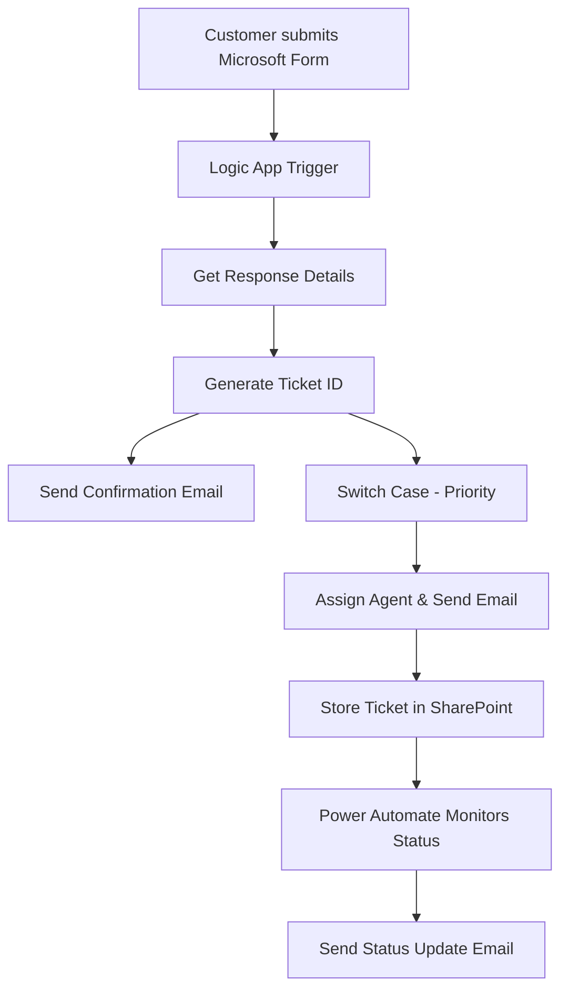

---

# 🚀 Customer Support Ticketing System

A **Cloud-based automated Customer Support Ticketing System** built using **Microsoft Forms, Azure Logic Apps, Power Automate, Outlook, and SharePoint** to streamline and manage customer support requests efficiently.

---

## 📌 Project Overview

This project automates the complete lifecycle of a support ticket—from submission to resolution.
It eliminates manual processes and ensures:

* Faster response times
* Organized ticket tracking
* Real-time communication
* Efficient agent assignment

The system is designed using **low-code/no-code cloud technologies**, making it scalable and easy to maintain.

---

## 🎯 Objective

The main objective of this project is to:

* Automate customer complaint handling
* Generate unique ticket IDs
* Assign tickets based on priority
* Send real-time email notifications
* Track ticket status efficiently

This ensures improved **customer satisfaction** and **reduced manual workload**.

---

## ⚙️ Tech Stack

| Component           | Tool Used         |
| ------------------- | ----------------- |
| Form Input          | Microsoft Forms   |
| Workflow Automation | Azure Logic Apps  |
| Email Notifications | Microsoft Outlook |
| Status Tracking     | Power Automate    |
| Data Storage        | SharePoint List   |
| Cloud Platform      | Microsoft Azure   |

---

## ✨ Key Features

### 📝 1. Microsoft Forms-Based Ticket Submission

* Users submit complaints via a structured form
* Captures:

  * Name, Email, Phone
  * Department
  * Subject & Description
  * Priority Level

---

### 🆔 2. Auto-Generated Ticket ID

* Unique ticket ID generated automatically
* Format example: `TKT-20240314123045`

---

### 📧 3. Customer Email Confirmation

* Instant email sent after submission
* Includes:

  * Ticket ID
  * Issue details
  * Confirmation message

---

### 🔄 4. Priority-Based Ticket Assignment

* Uses **Switch Case Logic**
* Routes tickets based on priority:

  * 🔴 Critical / High → Senior Agents
  * 🟡 Medium / Low → General Support

---

### 👨‍💻 5. Agent Notification

* Assigned agent receives detailed email:

  * Ticket ID
  * Customer info
  * Issue description
  * Priority

---

### 📊 6. Ticket Storage (SharePoint)

* All tickets stored in SharePoint List
* Fields include:

  * Ticket ID
  * Customer Info
  * Priority
  * Status

---

### 🔁 7. Real-Time Status Tracking

* Power Automate monitors status changes
* Sends automatic updates to customers:

  * Open
  * In Progress
  * Resolved

---

### 🔔 8. Automated Communication

* Two-way communication via email
* Keeps customers updated at every stage

---

### ⚡ 9. Low-Code Automation

* Built using Microsoft ecosystem
* No heavy coding required

---

### 📈 10. Scalable Architecture

* Supports multiple departments
* Easily extendable

---

## 🔄 Workflow Architecture



---

## 🛠️ Implementation Steps

1. **Microsoft Forms**

   * Created support ticket submission form

2. **Azure Logic Apps**

   * Trigger: *When a new response is submitted*
   * Action: *Get response details*
   * Generate Ticket ID
   * Send emails
   * Assign tickets

3. **Switch Case Logic**

   * Routes tickets based on priority

4. **SharePoint Integration**

   * Stores all ticket data

5. **Power Automate**

   * Detects status changes
   * Sends update emails

---

## 📸 Screenshots

*(Add your project screenshots here)*

---

## 📊 Results

* Automated ticket generation
* Faster response time
* Organized ticket tracking
* Real-time customer updates

---

## ✅ Conclusion

This project successfully demonstrates how **cloud-based automation** can improve customer support systems.

* Eliminates manual errors
* Improves efficiency
* Enhances communication
* Provides scalable architecture

---

## 🔮 Future Scope

* 🤖 AI Chatbot Integration (Bot Framework)
* 📱 Multi-channel support (Teams, Email, App)
* ⏱️ SLA Tracking & Auto Escalation
* 📊 Power BI Dashboard for analytics
* 📲 Mobile-friendly admin panel

---

## 📂 Project Structure

```
CustomerSupportTicketingSystem/
│── README.md
│── docs/
│── screenshots/
│── logic-app-config/
│── power-automate-flows/
```

---

## 🔗 GitHub Repository

👉 [Customer Support Ticketing System](https://github.com/GurjyotSingh740-gk/CustomerSupportTicketingSystem)

---

## 👨‍🎓 Author

**Gurjyot Singh**
🎓 MCA - Chandigarh University
📧 [24MCC20026@cuchd.in](mailto:24MCC20026@cuchd.in)

---

## 🙏 Acknowledgement

Special thanks to **Dr. Arun Kumar Singh** and Chandigarh University for guidance and support throughout this project. 

---

## ⭐ If you like this project

Give it a ⭐ on GitHub!

---

